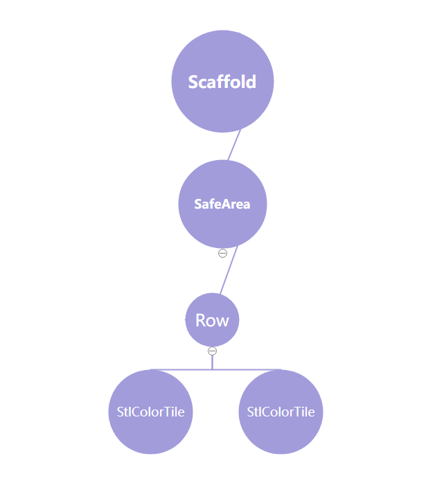

# 상태관리(State Management)
UI와 데이터를 효율적으로 관리하고 동기화하는 방식
## setState()
가장 기본적인 상태관리 방식(StatefulWidget)            
`setState()`가 프레임워크에 상태가 변화됬음을 알림 -> UI 갱신을 위해 `build` 메소드 호출
## Getx()
상태관리 뿐만 아니라 ,의존성및 라우터 관리를 할 수 있는 매우 효율적이고 간단한 라이브러리              
편의성이 너무 좋아서 코드가 복잡하다고 합니다.
### 작동 흐름
1. 상태를 위한 GetXController 클래스를 생성한다.
2. 컨트롤러는 observable한 프로퍼티들을 가지고 있다.
3. 컨트롤러의 상태를 업데이트한다.
4. GetConsumer가 변경을 감지한다.
5. 상태 변경에 따라 UI를 자동으로 재구성한다.

흐름이 이렇다는데 안써봐서 모르겠습니다.
## Provide()
플러터 전용으로 구축된 라이브러리임            
의존성을 주입하여 상태의 변화를 효과적으로 관리하고 UI에 쉽게 반영할 수 있게 해준다              
데이터의 흐름을 위젯 트리를 통해 쉽게 제어할 수 있도록 설계되어있다.
### 위젯 트리란?
```
@override
Widget build(BuildContext context) {
  return Scaffold(
    body: SafeArea(
      child: Row(
        children: [
          StlColorTile(),
          StlColorTile(),
        ],
      ),
    ),
  );
}
```
이런식으로 코드를 작성했다면 위젯트리는           

이와 같을 것이다.
### 작동 흐름
1. 상태를 위한 Provider repository를 생성한다.
2. Provider 위젯을 사용해서 repository에 접근 가능하다.
3. 서브 위젯들이 Provider.Of에 접근해서 상태를 소비(consume)한다.
4. Repository는 변경 사항을 리스너들에게 알린다.
5. Listenable provider들은 UI를 자동으로 리빌드한다.          

이 친구도 잘안써봐서 잘모르겠네요                

**장점**           
초보자든 전문가든 소형 프로젝트든 대형프로젝트든 사용한다는 것이다.          
그리고 `flutter`팀에서 권장되며 문서가 많다              

**단점**           
상태관리를 설정하고 사용하기 위한 보일러플레이트 코드가 반복되어 많이 필요할 수 있다.               

**보일러플레이트**         
최소한의 변경으로 여러곳에서 재사용되며, 반복적으로 비슷한 형태를 띄는 코드
## BLoC
이벤트 기반의 상태 관리를 제공하며, 애플리케이션의 비즈니스 로직을 UI로부터 분리한다. 이를 통해 테스트가 용이하고, 확장성이 보다 높은 앱 구조를 만들 수 있다.
